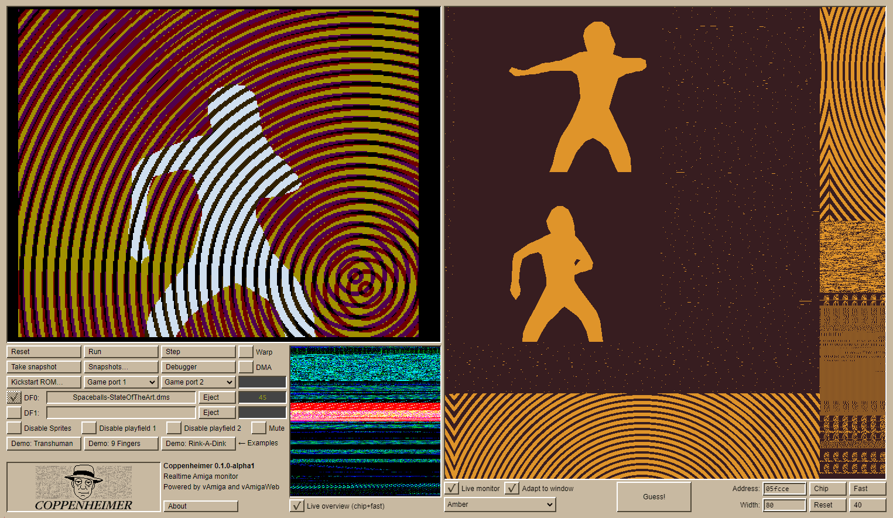

# Coppenheimer

An alternative UI for vAmigaWeb with realtime memory inspection.

Try! https://coppenheimer.heckmeck.de

Why? https://heckmeck.de/amigastyle/coppenheimer/

## Release notes

* **0.2** (2024-06-26)
  * Updates vAmigaWeb version
  * Adds DMA and memory monitors
  * More prominent play/pause button
* **0.1.0-alpha3** (2024-06-06)
  * Fixes Javascript error for "odd" screen DPI settings
* **0.1.0-alpha1** (2024-05-24)
  * Initial release

## Credits

Forked from [vAmigaWeb](https://github.com/vAmigaWeb/vAmigaWeb), with
[vAmiga](https://github.com/dirkwhoffmann/vAmiga) as the Amiga emulator
compiled to WebAssembly.

I cooked up an alternative UI and added some introspection hooks to
the vAmiga core. If something's broken, it's probably my fault and
working fine in [vAmigaWeb](https://vamigaweb.github.io/). Consider it
a proof of concept! :)

## Build instructions

I am not fluent in CMake, Make, or Emscripten, but this works
for me™, tested under Windows 11 and WSL2.

Prerequisites: cmake, emscripten, llvm-15 (or newer, I guess). At one point
and after a lot of head-scratching I also built
https://github.com/emscripten-core/emsdk.git from source, but I don't remember
if that step was strictly necessary.

To build:
* `mkdir build`
* `emcmake cmake -S . -B build`
* `cd build`
* `cmake --build . --target runphp`

PHP is not required, I just use it to include some files and set the version strings
in the replacement for the original `shell.html` (and I'm running PHP on my server anyway).
You can easily stitch together an equivalent `index.html` from `index.php`.
